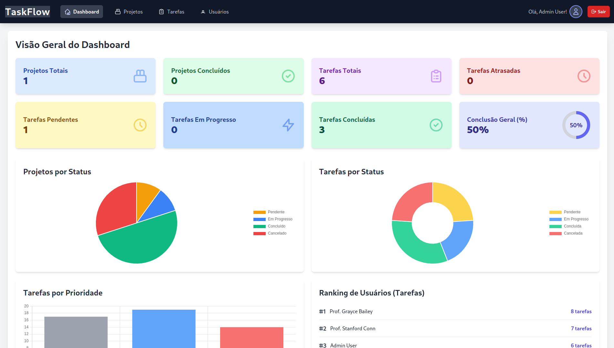
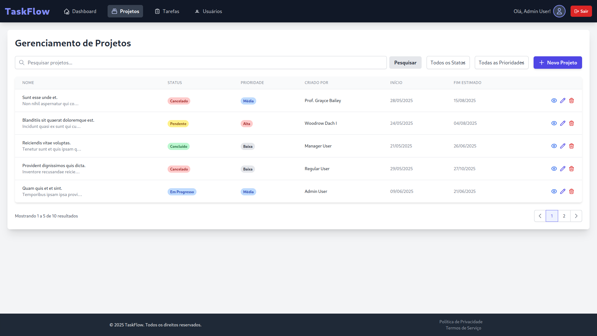

# 📋 TaskFlow: Sistema de Gerenciamento de Tarefas

## 📑 Sumário do Projeto

**TaskFlow** é uma aplicação web de gerenciamento de tarefas e projetos, desenvolvida para demonstrar proficiência em tecnologias modernas de backend e frontend. O sistema permite que usuários gerenciem tarefas e projetos, com funcionalidades de autenticação robustas e controle de acesso baseado em diferentes níveis de permissão.

### 🎯 Objetivo

Desenvolver uma aplicação web funcional e bem estruturada utilizando:

- **Laravel 10** (Backend API)
- **MySQL** (Base de dados relacional)
- **Vue.js 3** (Frontend SPA)

---

## ✨ Funcionalidades Principais

### 🔐 Autenticação de Usuários

- Registo e Login/Logout seguro.
- Autenticação de Dois Fatores (2FA) com código secreto manual (funcionalidade de QR Code despriorizada).
- Edição de perfil: nome, email, senha.

### 📁 Gestão de Projetos

- CRUD de projetos.
- Pesquisa e filtragem por status e prioridade.
- Paginação de 5 registros por página.
- Adição e remoção de membros (visível para administradores e gestores).

### ✅ Gestão de Tarefas

- CRUD de tarefas.
- Atribuição de tarefas a usuários.
- Marcação de tarefas como concluídas.
- Pesquisa e filtragem por status e prioridade.
- Paginação (5 por página).

### 💬 Comentários

- Adição e listagem de comentários em tarefas.

### 👥 Gestão de Usuários

- Listagem com paginação e pesquisa.
- Visualização, edição e exclusão de usuários (somente admins).

### 🔒 Controle de Acesso Baseado em Roles (RBAC)

- **admin**: acesso total. Não pode excluir a si mesmo.
- **manager**: pode gerenciar projetos e tarefas, mas não usuários.
- **user**: pode gerenciar suas próprias tarefas e ver projetos onde está envolvido.

### 📊 Dashboard Interativo

- 8 cards de estatísticas, gráficos e ranking de usuários.

### 🖌️ Layout Moderno

- Header e Footer estilizados.
- Design responsivo com Tailwind CSS.

---

## 🚀 Stack Tecnológica

### Backend

- PHP 8.1+
- Laravel 10
- MySQL
- Laravel Sanctum (autenticação)
- Pragmarx Google2FA

### Frontend

- Vue.js 3 (Composition API)
- Vite
- Tailwind CSS
- Axios
- Pinia
- Vue-Chartjs

---

## 📋 Pré-requisitos

- PHP 8.1+ (com `pdo_mysql`, `gd`, etc)
- Composer
- Node.js 18+ e npm
- MySQL Server 8+

---
# TaskFlow Management System

Um sistema completo de gestão de projetos e tarefas desenvolvido com Laravel (backend) e Vue.js (frontend).

## ⚙️ Instalação e Execução

### 🔧 Backend (Laravel)

```bash
git clone https://github.com/SEU_USUARIO/taskflow-management-system.git
cd taskflow-management-system/backend

cp .env.example .env
# Edite .env com suas configs
php artisan key:generate
composer install
php artisan migrate:fresh --seed
php artisan serve
```

### 🔧 Frontend (Vue.js)

```bash
cd ../frontend
cp .env.local.example .env.local
# Defina a API URL no .env.local: VITE_APP_API_URL=http://localhost:8000/api
npm install
npm run dev
```

### 🖥️ Abrir a Aplicação

Abra o navegador em: `http://localhost:5173`

## 👤 Usuários de Teste

### Administrador
- **Email:** admin@example.com
- **Senha:** password

### Usuário Padrão
- **Email:** user@example.com
- **Senha:** password

## 📸 Algumas Páginas






## 💡 Decisões Técnicas e Desafios

- SPA com Vue.js + RESTful API Laravel
- Autenticação com Sanctum (API Tokens e Cookies)
- RBAC com Policies e Gates
- Laravel Form Requests para validação
- Tailwind CSS para UI moderna
- Paginação e busca integradas
